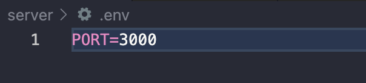

# e-commerce-app-thesis-project

## What e-commerce-app does

The e-commerce app is designed to facilitate buying and selling of products for registered users. It provides features such as persistent shopping carts, accurate stock management from checkout, and automatic removal of products with zero quantity from the marketplace, etc.

## Future Improvements

There are several areas that require attention for future development. Here are some of the key priorities:

- **Integration of Transaction Records:** The backend API currently maintains transaction records, but this functionality needs to be integrated into the frontend. This will enable users to view their transaction history and provide better transparency.
- **Persistent User Sessions:** Currently, when a page is refreshed, users are logged out due to the absence of browser storage. Implementing Session Storage or Local Storage along with Zustand (state management library) will allow user sessions to persist upon
- **Real Transactions with Stripe:** At present, the checkout process does not involve real transactions. To enable users to make actual payments and receive payments, integration with a payment gateway like Stripe is required. This will enhance the app's functionality and make it a fully functional e-commerce platform.
- **Improved Logout Functionality:** The app lacks a proper logout feature, and refreshing the page currently logs users out unintentionally. Implementing a dedicated logout mechanism will allow users to securely log out when desired.

## A quick glimpse into the app's UI

<<<<<<< HEAD

=======

> > > > > > > b576dbf (add readme)

## Set up

The first thing you will need to do is `npm i` in the root, client, and server directories.

Next you would need to create a .env file in your server directory and add a port number to run your backend server.

## Start the app

To start your backend API, go to the **server** directory and run `npm run serve` in the terminal.

To start your Vite server and serve your frontend assets go to the **client** directory and run **npm run dev** in the terminal.
